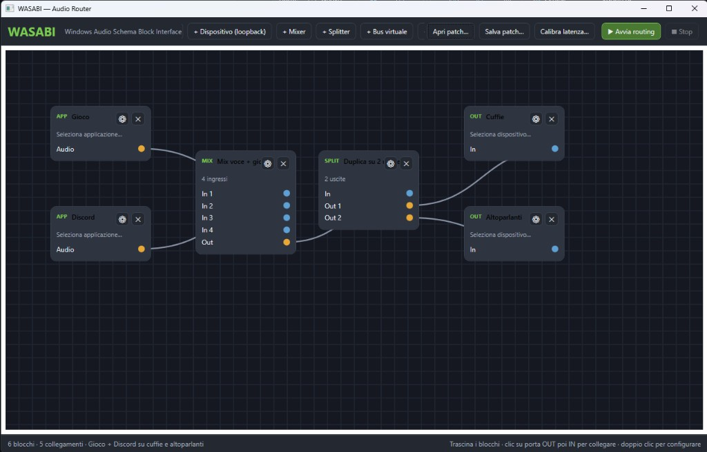

# WASABI

**W**indows **A**udio **S**chema **B**lock **I**nterface — a visual audio router for Windows.

WASABI lets you build block-based audio routing graphs: selectively capture application audio, mix it, split it, and send it to multiple outputs such as headphones, monitor speakers, and AUX devices.

## Typical use case

> Play **game + Discord** through both **headphones** and **speakers** at the same time.

```
[Game] ──┐
         ├── [Mixer] ── [Splitter] ──┬── [Headphones]
[Discord] ┘                          └── [Speakers]
```



1. Add **App** blocks for the game and Discord, then configure them with ⚙.
2. Connect both to a **Mixer**.
3. Connect the mixer to a **Splitter**.
4. Connect each splitter output to an **Output** block (headphones / speakers).
5. Click **▶ Start routing**.

## Automatic output calibration

Two different devices, such as USB headphones and an HDMI monitor, can have different hardware latencies.

1. Configure at least two **Output** blocks and stop routing.
2. Click **Calibrate latency…** and choose a microphone that can hear both outputs.
3. Start the test: WASABI plays three short chirps separately through each output.
4. Review the suggested values and click **Apply delays**.
5. Restart routing.

Calibration uses FFT/GCC-PHAT cross-correlation to compare the signal arrival time at the microphone and delay the faster output. Manual per-output compensation in ⚙ remains available for fine-tuning.

An external microphone near the listening position is more reliable. If the test reports a weak signal, increase the volume and repeat it in a quiet environment.

## Requirements

- Windows 10 (2004+) or Windows 11
- [.NET 8 SDK](https://dotnet.microsoft.com/download/dotnet/8.0)

> Per-app capture uses the Windows **Process Loopback** API, available from Windows 10 version 2004.

## Build and run

```powershell
cd c:\Users\angry\Projects\audiohandler
dotnet restore Wasabi.sln
dotnet build Wasabi.sln -c Release
dotnet run --project src\Wasabi.App\Wasabi.App.csproj -c Release
```

## Available blocks

| Block | Description |
|--------|-------------|
| **App** | Captures audio from a specific application (game, Discord, browser…) |
| **Device (loopback)** | Captures all audio playing through a device |
| **Mixer** | Mixes multiple sources into one signal |
| **Splitter** | Duplicates one signal to multiple outputs |
| **Virtual bus** | Internal signal-routing point in the graph |
| **Output** | Sends audio to a physical device (headphones, HDMI, AUX…) |

## Connections

1. Click an orange **OUT** port.
2. Click a blue **IN** port on the target block.
3. Drag blocks to rearrange the graph.

## Patches

Save and reload configurations in the `.wasabi.json` format.  
An example is available at `samples/game-discord-dual-output.wasabi.json`.

## Virtual devices

Windows cannot create true virtual audio devices from user mode without a signed kernel driver. WASABI addresses the use case differently:

- **Direct routing**: capture per-app audio and send it to multiple physical outputs without a virtual cable.
- **Virtual bus**: an internal graph node for organizing signals.
- **External virtual cables** (VB-Cable, VoiceMeeter…): detected as regular devices by Loopback and Output blocks.

## Notes

- Configure applications and devices with ⚙ on each block before starting.
- The editor is locked while routing is active; press **Stop** to edit.
- If an application produces no audio, its capture remains silent, as expected with WASAPI.

## License

MIT
